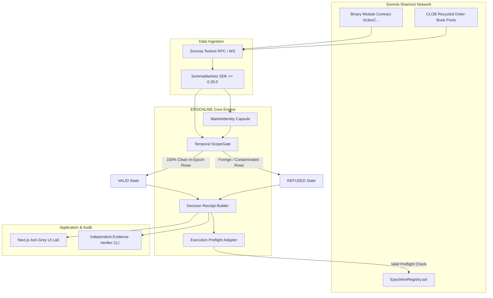

# ARCHITECTURE.md — EPOCHLINE System Architecture

## System Overview

## Core Modules

### 1. `MarketIdentity` (`src/core/marketIdentity.ts`)
Constructs the canonical identity object containing `marketId`, `symbol`, `venueId`, `asset`, `intervalSec`, `tradingStart`, `expiry`, `marketAddress`, `poolAddress`, and `capturedAtBlock`.

### 2. `ScopeGate` (`src/core/scopeGate.ts`)
Evaluates evidence items against the canonical `MarketIdentity`. Fails closed if any item contains mismatched `marketId`, mismatched `poolAddress`, out-of-window `timestamp`, or missing provenance.

### 3. `HistoryAdapter` (`src/core/historyAdapter.ts`)
Provides the comparative paths:
- `readPoolHistory`: The naive un-scoped pool ingestion path.
- `readMarketHistory`: The safe, identity-gated provenance path.

### 4. `DecisionReceipt` (`src/core/decisionReceipt.ts`)
Computes Keccak-256 evidence hashes, market identity hashes, and policy hashes into a single verifiable receipt.

### 5. `ExecutionAdapter` (`src/core/executionAdapter.ts`)
Preflights execution on-chain by requiring `Trading` status (`1`), valid active time window, and verified receipt before order broadcast.

### 6. `EpochlineRegistry` (`contracts/EpochlineRegistry.sol`)
On-chain attestation registry recording `(marketId, receiptHash, evidenceHash, agent, timestamp)`.
