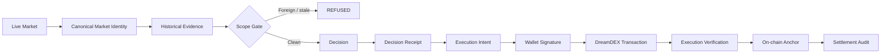
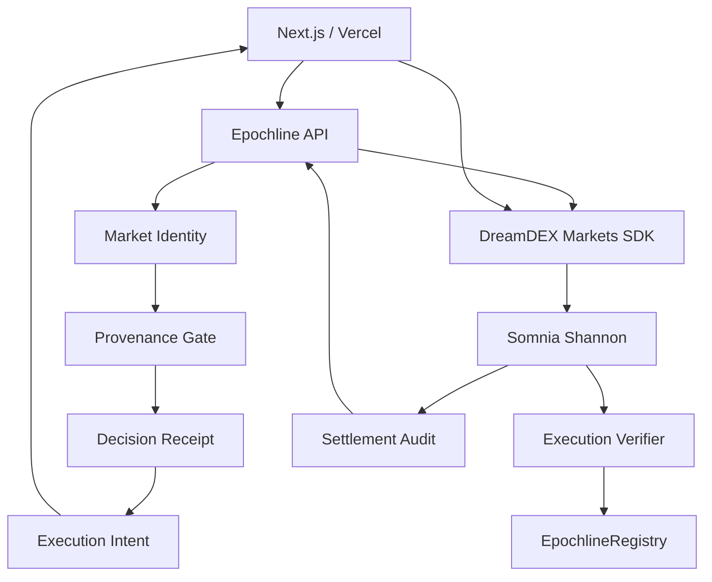

# EPOCHLINE


> **A provenance firewall for DreamDEX Event Contracts.**
>
> **EPOCHLINE makes market identity part of the execution boundary: contaminated evidence is rejected before a wallet-signed order can execute.**


## Review This First

| Proof | What it demonstrates |
|---|---|
| **[Discovery](DISCOVERY.md)** | Live evidence that DreamDEX pools are reused across market instances |
| **[Break Test](EVIDENCE.md)** | Baseline pool history versus deterministic provenance rejection |
| **[Execution Proof](PROOF.md)** | Wallet-signed DreamDEX execution linked to a validated receipt |
| **[Cryptographic Proof](PROOF.md)** | Receipt → intent → execution → on-chain anchor |
| **[Independent Verifier](PROOF.md)** | Reproducible verification of evidence and hashes |

### Live Deployment & Testnet Proofs

| Resource | Destination |
|---|---|
| **Youtube Video** | [Watch on Youtube](https://youtu.be/oR07d3uEICk?si=pUqanvV5boF8VAEZ) |
| **Live Web App** | [https://epochline.vercel.app](https://epochline.vercel.app) |
| **Provenance Lab** | [https://epochline.vercel.app/lab](https://epochline.vercel.app/lab) |
| **Proof & Audit Center** | [https://epochline.vercel.app/proof](https://epochline.vercel.app/proof) |
| **EpochlineRegistry Contract** | [`0x029192f49d95ed5b147ce7e6fc18d01bdfb513c5`](https://shannon-explorer.somnia.network/address/0x029192f49d95ed5b147ce7e6fc18d01bdfb513c5) |
| **Decision Receipt Anchor** | [`0x519aed15d65c54a40a59e9b5149bac1509b83e21529a2d6251ef8440129a725e`](https://shannon-explorer.somnia.network/tx/0x519aed15d65c54a40a59e9b5149bac1509b83e21529a2d6251ef8440129a725e) |
| **Execution Seal Anchor** | [`0xff8004ae6e4c87396e985cb2ef9ae35df937fa70bb5c9f8dc4cdbadb77209bf7`](https://shannon-explorer.somnia.network/tx/0xff8004ae6e4c87396e985cb2ef9ae35df937fa70bb5c9f8dc4cdbadb77209bf7) |
| **OracleHub Contract** | [`0xe40db387cC98601Dd11bd634fF2f3AD5686dE32b`](https://shannon-explorer.somnia.network/address/0xe40db387cC98601Dd11bd634fF2f3AD5686dE32b) |

## The Problem

DreamDEX Event Contracts run in rolling market windows. The protocol reuses order-book pools across successive market instances, while `marketId` is the canonical market identity. DreamDEX explicitly warns builders not to key persistent state by pool address and documents that pool-keyed fills/candles can span successive markets unless reads are scoped to the target window. 

The failure is subtle:

```text
POOL HISTORY
    ↓
multiple market instances
    ↓
plausible historical rows
    ↓
wrong evidence enters context
    ↓
plausible decision
    ↓
unsafe execution
```

## The Discovery

EPOCHLINE began with a live protocol probe, not a feature list.

The probe maps:

```text
marketId
pool
tradingStart
expiry
fills
candles
on-chain status
```

and demonstrates the difference between broad pool history and correctly scoped market history.

> **The pool is infrastructure. The market instance is identity.**

See [`DISCOVERY.md`](DISCOVERY.md) and [`evidence/`](evidence/).

## The Solution

EPOCHLINE places a deterministic provenance boundary between DreamDEX market evidence and execution.

```text
DreamDEX
   ↓
Market Identity
   ↓
Evidence Scope Gate
   ├─ wrong market → REFUSE
   ├─ wrong window → REFUSE
   ├─ missing provenance → REFUSE
   └─ clean evidence → VALID
                         ↓
                  Decision Receipt
                         ↓
                  Execution Intent
                         ↓
                   Wallet Signature
                         ↓
                  DreamDEX Transaction
                         ↓
                 Independent Verification
                         ↓
                    On-chain Anchor
```

EPOCHLINE does not claim to make predictions more accurate. It makes the decision context explicit, bounded and independently checkable.

## Explore in 2 Minutes

1. Open `/lab` and select a live Event Contract.
2. Inspect its `marketId`, pool and temporal window.
3. Inject history from another market instance using the recycled pool.
4. Watch the naive context accept it while EPOCHLINE returns `REFUSED`.
5. Open the receipt, prepare an execution intent, sign a Shannon testnet trade and inspect the linked proof.

## Product Flow



## The Hard Invariant

> **A decision is VALID only when every accepted market-derived evidence item belongs to the exact target `marketId`, the target venue/pool binding, and the target market's valid temporal interval.**

```text
∀ accepted evidence e:
marketId(e) = target.marketId
AND venue(e) = target.venue
AND pool(e) = target.pool
AND timestamp(e) ∈ [tradingStart, expiry]
```

Unknown provenance fails closed.

## Proof-Carrying Execution

The final execution chain is:

```text
Evidence Hash
    ↓
Decision Receipt Hash
    ↓
Execution Intent Hash
    ↓
Wallet Signature
    ↓
DreamDEX Transaction
    ↓
Execution Verification
    ↓
EpochlineRegistry Anchor
```

This closes the key trust gap between “the evidence was clean” and “the actual trade was generated from that clean context”.

## Adversarial Tests

| Attack | Expected result |
|---|---|
| Reused-pool contamination | **REFUSED** |
| Cross-market injection | **REFUSED** |
| Cross-asset evidence | **REFUSED** |
| Out-of-window evidence | **REFUSED** |
| Missing provenance | **REFUSED** |
| Receipt replay | **REFUSED** |
| Successor-market reuse | **REFUSED** |
| Market locks before execution | **REFUSED** |
| Receipt tampering | **DETECTED** |

## Architecture



## Design Philosophy

EPOCHLINE provides a dedicated, lightweight verification firewall layer underneath Event Contract automated strategies:
- **Evidence provenance before execution**: Strict fail-closed boundary enforcement.
- **Market-instance integrity**: Prevention of cross-market and recycled-pool data contamination.
- **Receipt-to-execution integrity**: Cryptographic linkage between market state, decision context, signed intent, and settled transaction.

The goal is orthogonality: a reusable verification layer underneath any Event Contract application or autonomous trading agent.

## DreamDEX Integration

EPOCHLINE uses the official Event Contract SDK, dynamic market discovery, on-chain market-state checks, order-book/history surfaces, transaction verification and settlement state.

DreamDEX's current architecture explicitly requires on-chain status checks before writes and documents the pool-reuse / `marketId` identity boundary.

## On-Chain Proof

### Registry

`0x029192f49d95ed5b147ce7e6fc18d01bdfb513c5`

[View on Shannon Explorer](https://shannon-explorer.somnia.network/address/0x029192f49d95ed5b147ce7e6fc18d01bdfb513c5)

### Confirmed Anchor

`0x519aed15d65c54a40a59e9b5149bac1509b83e21529a2d6251ef8440129a725e`

[View transaction](https://shannon-explorer.somnia.network/tx/0x519aed15d65c54a40a59e9b5149bac1509b83e21529a2d6251ef8440129a725e)

## Evidence & Verification

```bash
npm run test
npm run verify:evidence
npm run test:e2e
npm run typecheck
npm run lint
npm run build
```

Every empirical claim should resolve to an evidence file, a reproducible command, or an on-chain reference.

## Honest Limits

EPOCHLINE does not guarantee profitability, model accuracy or oracle correctness. It guarantees only the narrower property it actually implements: a validated execution can be tied back to a defined market instance, the evidence admitted into its decision context, and the transaction that followed it.

## Final Thesis

Prediction-market infrastructure does not only need better predictions.

It needs trustworthy context.

> **EPOCHLINE does not ask an agent to trust its context. It makes the context verifiable before execution.**
