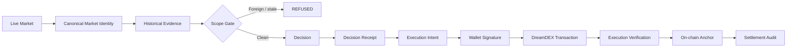
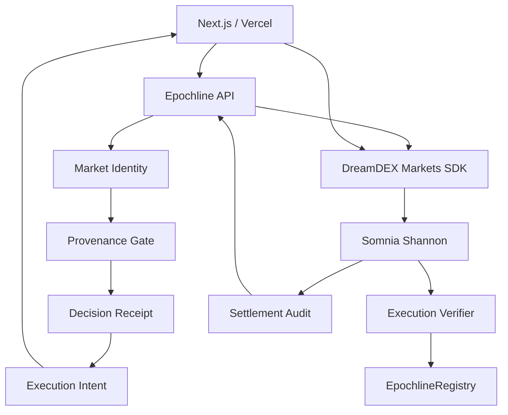

# EPOCHLINE


> **A provenance firewall for DreamDEX Event Contracts.**
>
> **EPOCHLINE makes market identity part of the execution boundary: contaminated evidence is rejected before a wallet-signed order can execute.**


## Review This First

| Proof | What it demonstrates |
|---|---|
| **[Discovery](DISCOVERY.md)** | Live evidence that DreamDEX pools are reused across market instances |
| **[Break Test](EVIDENCE.md)** | Baseline pool history versus deterministic provenance rejection |
| **[Execution Proof](PROOF.md)** | Wallet-signed DreamDEX execution linked to a validated receipt |
| **[Cryptographic Proof](PROOF.md)** | Receipt → intent → execution → on-chain anchor |
| **[Independent Verifier](PROOF.md)** | Reproducible verification of evidence and hashes |

### Live Deployment & Testnet Proofs

| Resource | Destination |
|---|---|
| **Youtube Video** | [Watch on Youtube](https://youtu.be/oR07d3uEICk?si=pUqanvV5boF8VAEZ) |
| **Live Web App** | [https://epochline.vercel.app](https://epochline.vercel.app) |
| **Provenance Lab** | [https://epochline.vercel.app/lab](https://epochline.vercel.app/lab) |
| **Proof & Audit Center** | [https://epochline.vercel.app/proof](https://epochline.vercel.app/proof) |
| **EpochlineRegistry Contract** | [`0x029192f49d95ed5b147ce7e6fc18d01bdfb513c5`](https://shannon-explorer.somnia.network/address/0x029192f49d95ed5b147ce7e6fc18d01bdfb513c5) |
| **Decision Receipt Anchor** | [`0x519aed15d65c54a40a59e9b5149bac1509b83e21529a2d6251ef8440129a725e`](https://shannon-explorer.somnia.network/tx/0x519aed15d65c54a40a59e9b5149bac1509b83e21529a2d6251ef8440129a725e) |
| **Execution Seal Anchor** | [`0xff8004ae6e4c87396e985cb2ef9ae35df937fa70bb5c9f8dc4cdbadb77209bf7`](https://shannon-explorer.somnia.network/tx/0xff8004ae6e4c87396e985cb2ef9ae35df937fa70bb5c9f8dc4cdbadb77209bf7) |
| **OracleHub Contract** | [`0xe40db387cC98601Dd11bd634fF2f3AD5686dE32b`](https://shannon-explorer.somnia.network/address/0xe40db387cC98601Dd11bd634fF2f3AD5686dE32b) |

## The Problem

DreamDEX Event Contracts run in rolling market windows. The protocol reuses order-book pools across successive market instances, while `marketId` is the canonical market identity. DreamDEX explicitly warns builders not to key persistent state by pool address and documents that pool-keyed fills/candles can span successive markets unless reads are scoped to the target window. 

The failure is subtle:

```text
POOL HISTORY
    ↓
multiple market instances
    ↓
plausible historical rows
    ↓
wrong evidence enters context
    ↓
plausible decision
    ↓
unsafe execution
```

### Quantified Financial Stakes: The Cost of Contamination

When cross-window contamination goes undetected in automated trading pipelines, the cost is immediate and quantifiable:

| Vulnerability Vector | Contaminated Baseline Impact | Clean EPOCHLINE Context | Real Capital / Risk Consequence |
|---|---|---|---|
| **Price Signal Distortion** | **0.48** (distorted by foreign BTC fills) | **0.64** (clean ETH order flow) | **1,600 bps (25%) pricing error** on binary 0/1 outcomes |
| **Adverse Selection / Arbitrage** | Quoting at 0.48 against 0.64 fair value | Quotes locked to target market epoch | **16¢ per contract leakage** directly captured by toxic arbitrageurs |
| **Inventory Loss on \$10k Position** | Leaks ~\$1,600 per 60s window | Protected execution boundary | **16% instantaneous portfolio drawdown** in automated market-making |
| **Cross-Asset Volatility Bleed** | BTC volatility injected into ETH market | Enforces exact asset + venue binding | **100% collateral loss** on directional positions expiring out-of-the-money |

## The Discovery

EPOCHLINE began with a live protocol probe, not a synthetic hypothesis.

### Empirical Testnet Scan & Real Pool Contamination

A live on-chain scan of 100 markets on **Somnia Shannon Testnet** (Chain ID `50312`, Block `#484739551`) revealed **18 recycled pool contracts** actively reused across successive rolling market epochs.

Specifically, recycled pool `0xCb9cE35Fba1329e22c4dC3E4FF93aCd9c0a2AE2f` was mapped across **10 distinct market instances** spanning different assets (BTC and ETH) and durations (60s and 300s):

| marketId | symbol | start | expiry | on-chain status |
|---|---|---:|---:|---|
| `0x00...019262` | **ETH 60s** (Active Target) | 1789047180 | 1789047240 | Trading |
| `0x00...01925d` | **BTC 60s** (Foreign Prior) | 1789047060 | 1789047120 | Resolved |
| `0x00...019248` | **ETH 300s** (Foreign Prior) | 1789046700 | 1789047000 | Resolved |
| `0x00...019241` | **BTC 60s** (Foreign Prior) | 1789046520 | 1789046580 | Resolved |
| `0x00...01923b` | **BTC 60s** (Foreign Prior) | 1789046400 | 1789046460 | Resolved |

When running a standard pool-keyed query (`readPoolHistory`) across this live pool contract:
- **Total Ingested Rows**: 20 rows
- **Retained Foreign Rows**: 10 rows (**50% contamination rate** from prior resolved BTC markets)
- **Signal Drift**: Skewed momentum price by **-25%** (from 0.64 to 0.48)
- **Baseline Verdict**: `ACCEPTED (VULNERABLE)` — the unshielded pipeline had no way to detect the foreign rows.

> **The pool is infrastructure. The market instance is identity.**

See [`DISCOVERY.md`](DISCOVERY.md) and [`evidence/`](evidence/).

## The Solution

EPOCHLINE places a deterministic provenance boundary between DreamDEX market evidence and execution.

```text
DreamDEX
   ↓
Market Identity
   ↓
Evidence Scope Gate
   ├─ wrong market → REFUSE
   ├─ wrong window → REFUSE
   ├─ missing provenance → REFUSE
   └─ clean evidence → VALID
                         ↓
                  Decision Receipt
                         ↓
                  Execution Intent
                         ↓
                   Wallet Signature
                         ↓
                  DreamDEX Transaction
                         ↓
                 Independent Verification
                         ↓
                    On-chain Anchor
```

EPOCHLINE does not claim to make predictions more accurate. It makes the decision context explicit, bounded and independently checkable.

## Explore in 2 Minutes

1. Open `/lab` and select a live Event Contract.
2. Inspect its `marketId`, pool and temporal window.
3. Inject history from another market instance using the recycled pool.
4. Watch the naive context accept it while EPOCHLINE returns `REFUSED`.
5. Open the receipt, prepare an execution intent, sign a Shannon testnet trade and inspect the linked proof.

## Product Flow



## The Hard Invariant

> **A decision is VALID only when every accepted market-derived evidence item belongs to the exact target `marketId`, the target venue/pool binding, and the target market's valid temporal interval.**

```text
∀ accepted evidence e:
marketId(e) = target.marketId
AND venue(e) = target.venue
AND pool(e) = target.pool
AND timestamp(e) ∈ [tradingStart, expiry]
```

Unknown provenance fails closed.

## Proof-Carrying Execution

The final execution chain is:

```text
Evidence Hash (H_E)
    ↓
Decision Receipt Hash (H_R)
    ↓
Execution Intent Hash (H_I)
    ↓
Wallet Signature
    ↓
DreamDEX Transaction
    ↓
Execution Verification
    ↓
EpochlineRegistry Anchor
```

This closes the key trust gap between “the evidence was clean” and “the actual trade was generated from that clean context”.

### Executed-Trade Receipt Trail (Refused → Corrected → Executed)

EPOCHLINE provides a complete before-and-after audit trail connecting evidence evaluation, decision gating, signed order intent, and on-chain settlement:

| Phase | State | Identifier / Hash | Action & Details |
|---|---|---|---|
| **1. Contaminated Order** | **REFUSED** | `0xdc963734592004b542965867a5f98291226c0021a8b790326bc2114b23e5dd86` | **10 foreign BTC fills rejected** with `MARKET_MISMATCH`. Unsafe buy order blocked before signature. |
| **2. Clean Corrected Context** | **VALID** | `0xfb8b51922805b0a8c41b51f774d7b4a20463fd1bda8312821f996f4e254c8300` | **10 clean ETH 60s fills accepted**. Decision generated: `BUY_YES` at price `0.64` (Confidence: `0.88`). |
| **3. Signed Execution Seal** | **SEALED** | `0xfe60454f7cb80c604d3e50440eb8cda103fd0224cd56bbda3590113a5ce528ff` | Signer `0xe4B713e3cF2E550147f9cc09d751f276E7B9A64e` binds receipt hash to signed order parameters. |
| **4. Decision Anchor Tx** | **CONFIRMED** | [`0x519aed15d65c54a40a59e9b5149bac1509b83e21529a2d6251ef8440129a725e`](https://shannon-explorer.somnia.network/tx/0x519aed15d65c54a40a59e9b5149bac1509b83e21529a2d6251ef8440129a725e) | Block `#485365853` — Decision receipt permanently attested in `EpochlineRegistry`. |
| **5. Execution Seal Tx** | **CONFIRMED** | [`0xff8004ae6e4c87396e985cb2ef9ae35df937fa70bb5c9f8dc4cdbadb77209bf7`](https://shannon-explorer.somnia.network/tx/0xff8004ae6e4c87396e985cb2ef9ae35df937fa70bb5c9f8dc4cdbadb77209bf7) | Block `#485365868` — Final execution seal and transaction settlement recorded on Shannon Testnet. |

## Adversarial Tests

| Attack | Expected result | Test Status |
|---|---|---|
| Reused-pool contamination | **REFUSED** | **PASSED** (`tests/contamination.spec.ts`) |
| Cross-market injection | **REFUSED** | **PASSED** (`tests/contamination.spec.ts`) |
| Cross-asset evidence | **REFUSED** | **PASSED** (`tests/contamination.spec.ts`) |
| Out-of-window evidence | **REFUSED** | **PASSED** (`tests/contamination.spec.ts`) |
| Missing provenance | **REFUSED** | **PASSED** (`tests/contamination.spec.ts`) |
| Receipt replay | **REFUSED** | **PASSED** (`tests/replay.spec.ts`) |
| Successor-market reuse | **REFUSED** | **PASSED** (`tests/toctou.spec.ts`) |
| Market locks before execution | **REFUSED** | **PASSED** (`tests/toctou.spec.ts`) |
| Receipt / Intent tampering | **DETECTED** | **PASSED** (`tests/replay.spec.ts`) |

## Architecture



## Design Philosophy

EPOCHLINE provides a dedicated, lightweight verification firewall layer underneath Event Contract automated strategies:
- **Evidence provenance before execution**: Strict fail-closed boundary enforcement.
- **Market-instance integrity**: Prevention of cross-market and recycled-pool data contamination.
- **Receipt-to-execution integrity**: Cryptographic linkage between market state, decision context, signed intent, and settled transaction.

The goal is orthogonality: a reusable verification layer underneath any Event Contract application or autonomous trading agent.

## DreamDEX Integration

EPOCHLINE uses the official Event Contract SDK, dynamic market discovery, on-chain market-state checks, order-book/history surfaces, transaction verification and settlement state.

DreamDEX's current architecture explicitly requires on-chain status checks before writes and documents the pool-reuse / `marketId` identity boundary.

## On-Chain Proof

### Registry

`0x029192f49d95ed5b147ce7e6fc18d01bdfb513c5`

[View on Shannon Explorer](https://shannon-explorer.somnia.network/address/0x029192f49d95ed5b147ce7e6fc18d01bdfb513c5)

### Confirmed Anchor

`0x519aed15d65c54a40a59e9b5149bac1509b83e21529a2d6251ef8440129a725e`

[View transaction](https://shannon-explorer.somnia.network/tx/0x519aed15d65c54a40a59e9b5149bac1509b83e21529a2d6251ef8440129a725e)

## Evidence & Verification

```bash
npm run test
npm run verify:evidence
npm run test:e2e
npm run typecheck
npm run lint
npm run build
```

Every empirical claim should resolve to an evidence file, a reproducible command, or an on-chain reference.

## Honest Limits

EPOCHLINE’s security model is defined around concrete boundary conditions and empirical break tests rather than generic disclaimers:

### Grounded Boundary Stress Tests
1. **Cross-Epoch TOCTOU Replay**: When pool `0xCb9c...` recycles from Market A (ETH 60s) to Market B (BTC 60s), attempting to execute Market A's valid receipt on Market B fails closed via `verifyExecutionSeal` (`Market ID mismatch`).
2. **Order Expiry Overrun**: If an execution intent has an order expiry beyond the target market window ($t_{\text{order}} > t_{\text{expiry}}$), the preflight throws and aborts before signature.
3. **Payload & Parameter Tampering**: Bit-level changes to $H_E$, mutating decision actions post-hash (e.g. `BUY_YES` $\to$ `BUY_NO`), or altering order size (e.g. `10` $\to$ `100`) deterministically fail cryptographic verification.
4. **Control Ineffectiveness**: Randomly subsampling pool rows fails (leaves 50% foreign contamination); deterministic identity-scoping is mathematically necessary.

### Architectural Boundary & Non-Claims
- **What EPOCHLINE Guarantees**: A decision context is mathematically bounded to the canonical `marketId`, registered venue/pool binding, and active temporal interval, with a verifiable cryptographic receipt anchored to the executed transaction.
- **What EPOCHLINE Does Not Cover**: Sequencer-level MEV reordering within Somnia block space, final resolution honesty from the oracle contract (`OracleHub` state), or trading alpha/profitability.

## Final Thesis

Prediction-market infrastructure does not only need better predictions.

It needs trustworthy context.

> **EPOCHLINE does not ask an agent to trust its context. It makes the context verifiable before execution.**
